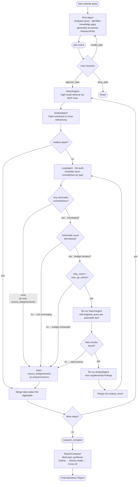

# Orchestrator — Architecture & Reference

## Table of Contents

1. [Overview](#overview)
2. [Agent Roles](#agent-roles)
   - [Root — The Orchestrator](#root--the-orchestrator)
   - [SearchAgent](#searchagent)
   - [AnalystAgent](#analystagent)
   - [LoopAgent (QA)](#loopagent-qa)
   - [ReportComposer](#reportcomposer)
3. [Key Data Structures](#key-data-structures)
   - [SubAgent](#subagent)
   - [AgentPool](#agentpool)
   - [Contradiction](#contradiction)
4. [Execution Pipeline](#execution-pipeline)
   - [Phase 1 — Plan](#phase-1--plan)
   - [Phase 2 — Execute](#phase-2--execute)
   - [Phase 3 — Synthesize](#phase-3--synthesize)
   - [The QA Retry Loop](#the-qa-retry-loop)
5. [Model Selection Strategy](#model-selection-strategy)
6. [WebSocket API (`/ws/research`)](#websocket-api-wsresearch)
   - [Inbound Messages](#inbound-messages)
   - [Outbound Messages](#outbound-messages)
   - [Full Conversation Flow](#full-conversation-flow)
7. [Relationship to v1 (`ResearchAgent`)](#relationship-to-v1-researchagent)
8. [Configuration](#configuration)
9. [Extending the Orchestrator](#extending-the-orchestrator)

---

## Overview

The `Orchestrator` is a **multi-agent research engine**. Instead of a single model handling every stage of a research task, it coordinates a team of five purpose-built sub-agents, each with a tightly scoped responsibility. This separation of concerns improves output quality in three concrete ways:

- **Specialisation** — each agent is prompted and, optionally, model-selected for its specific role.
- **Verification** — the `LoopAgent` audits every batch of findings *before* they reach synthesis, catching contradictions that a single agent would silently swallow.
- **Transparency** — the pipeline is broken into discrete, observable phases that the frontend can track step by step.

The `Orchestrator` itself acts as the **Root agent**: a high-reasoning planner that maps an arbitrary user query into a structured `ResearchPlan`, then dispatches sub-agents to execute it.

---

## Agent Roles

### Root — The Orchestrator

| Attribute | Value |
|---|---|
| `AgentRole` | `ROOT` |
| Typical model tier | Highest available (e.g. `gpt-5.2`, `claude-sonnet`, `gemini-2.5-pro`) |
| Output | `ResearchPlan` (JSON → parsed into `ResearchPlan` dataclass) |

The Root agent performs three things at plan time:

1. **Deep query analysis** — reads the user's prompt and infers the true information need.
2. **Knowledge-gap identification** — lists what is *not yet known* and must be filled.
3. **Plan decomposition** — converts those gaps into a numbered list of discrete, independently executable research steps.

It is also invoked when the user requests a plan modification (`modify_plan`), receiving the original plan and the user's feedback to regenerate an updated version.

---

### SearchAgent

| Attribute | Value |
|---|---|
| `AgentRole` | `SEARCH` |
| Typical model tier | Lighter / faster (e.g. `gpt-5-nano`, `claude-haiku`, `llama3.2`) |
| MCP tools | Full tool access (web search, web scraper) |
| Output shape | `{"sources": [{"url", "title", "knowledge_snippet"}], "coverage_notes": "..."}` |

The SearchAgent is optimised for **high recall**. Its system prompt explicitly instructs it to:

- Prefer primary sources (academic papers, official documentation, government data, reputable journalism).
- Bypass SEO-spam, link farms, and thin content pages.
- Return *verbatim* excerpts rather than paraphrasing — raw fidelity is preserved for the AnalystAgent to work from.

It is the only agent that receives MCP tool specs at call time, giving it live access to the `web_search` and `fetch` MCP servers registered in `MCPServerRegistry`.

---

### AnalystAgent

| Attribute | Value |
|---|---|
| `AgentRole` | `ANALYST` |
| Typical model tier | Lighter / faster |
| MCP tools | None — works on data already retrieved by SearchAgent |
| Output shape | `{"claims": [...], "tensions": [...], "analyst_notes": "..."}` |

The AnalystAgent is a **data extraction and cross-referencing** specialist. Given the SearchAgent's raw source excerpts, it:

1. Extracts discrete, source-attributed factual claims.
2. Groups claims by topic and notes which sources corroborate or conflict with each other.
3. Surfaces tensions (positions A vs B on the same topic) *without resolving them* — resolution is the LoopAgent's job.

The structured `claims` / `tensions` output is the canonical intermediate representation consumed by the QA layer.

---

### LoopAgent (QA)

| Attribute | Value |
|---|---|
| `AgentRole` | `LOOP` |
| Typical model tier | High reasoning (same as Root) |
| MCP tools | None — audits structured data only |
| Output shape | `{"contradictions": [...], "verdict": "clean"\|"flagged", "notes": "..."}` |

The LoopAgent is the **quality-assurance critic**. It has exactly one job: find and classify contradictions. It does not summarise, generate new content, or form opinions. For every conflict it produces a `Contradiction` record containing verbatim quotes from each side and a `contradiction_type` that determines how the Orchestrator handles it:

- **`factual_error` / `temporal_mismatch`** — objectively resolvable; a targeted re-search is triggered.
- **`source_disagreement`** — genuine multi-perspective conflict; injected as an analyst tension and forwarded to the ReportComposer as a finding.
- **`insufficient_evidence`** — weak corroboration; added to analyst recommendations for subsequent steps.

Its `audit()` method is the integration point:

```python
audit_result: AuditResult = await orchestrator.agents.loop.audit(analyst_output)
```

A `verdict` of `"clean"` means findings passed QA and synthesis can proceed immediately. A `verdict` of `"flagged"` triggers the [QA retry loop](#the-qa-retry-loop) — but only for contradictions classified as actionable types.

---

### ReportComposer

| Attribute | Value |
|---|---|
| `AgentRole` | `REPORT` |
| Typical model tier | Highest available |
| MCP tools | None — synthesises from vetted structured data |
| Output shape | Plain-text research document (no Markdown syntax) |

The ReportComposer is the **terminal specialist**. It receives the fully aggregated, QA-approved analyst output and produces a polished research report in plain text with six mandatory sections:

| Section | Content |
|---|---|
| Executive Summary | Concise overview of what was found and why it matters |
| Key Findings | Evidence-backed claims, each linked to its source(s) via `[N]` citations |
| Novel Insights | Non-obvious conclusions from cross-source analysis |
| Recommendations | Concrete recommendations the reader can act on |
| Knowledge Gaps | Open questions for further research |
| References | Numbered list of every source gathered during research |

The system prompt explicitly prohibits Markdown syntax (no `**`, `#`, `-` list markers, code fences, or horizontal rules). All lists use numbered form (`1. 2. 3.`) and section headers are plain uppercase labels.

---

## Key Data Structures

### SubAgent

```
SubAgent
├── role:          AgentRole
├── model:         ModelBackend
├── system_prompt: str
├── agent_id:      str (UUID)
├── status:        AgentStatus
└── run(prompt, model_override?, tools?, extra_messages?) → ModelResponse
```

`SubAgent` is a thin, stateless wrapper. It builds the message list (`[system, user, ...extra]`), calls `model.generate()`, and returns the raw `ModelResponse`. All orchestration state lives in `Orchestrator`, not in the sub-agents.

`AgentStatus` tracks the lifecycle of a single `run()` call: `IDLE → RUNNING → WAITING | DONE | ERROR`. `WAITING` is set when a sub-agent is blocked on another agent's output (e.g. inside the parallel batch executor).

---

### AgentPool

```
AgentPool
├── root_backend:    ModelBackend   (used by Orchestrator directly)
├── search_backend:  ModelBackend
├── analyst_backend: ModelBackend
├── loop_backend:    ModelBackend
├── report_backend:  ModelBackend
│
├── search:  SearchAgent
├── analyst: AnalystAgent
├── loop:    LoopAgent
└── report:  ReportComposer
```

`AgentPool` is a dataclass that pairs each sub-agent with its own `ModelBackend`. This makes it straightforward to run the Root and ReportComposer on an expensive high-reasoning model while the SearchAgent and AnalystAgent use a faster, cheaper one.

```python
# All agents share one backend (simplest setup)
pool = AgentPool.from_single_backend(backend)

# Different backends per role (cost/quality optimisation)
pool = AgentPool(
    root_backend=high_reasoning_backend,
    search_backend=fast_backend,
    analyst_backend=fast_backend,
    loop_backend=high_reasoning_backend,
    report_backend=high_reasoning_backend,
)
orchestrator = Orchestrator(config, mcp_registry, agent_pool=pool)
```

---

### Contradiction

```python
@dataclass
class Contradiction:
    id:                 str       # UUID
    source_a:           str       # URL or source identifier
    claim_a:            str       # Verbatim claim from source A
    source_b:           str       # URL or source identifier
    claim_b:            str       # Verbatim claim from source B
    context:            str       # What topic/fact the conflict concerns
    resolved:           bool      # Set to True once resolved by a retry
    resolution:         str|None  # Optional resolution text
    flagged_at:         datetime  # UTC timestamp
    targeted_query:     str|None  # Search query to resolve (factual types only)
    contradiction_type: str       # See table below
```

| `contradiction_type` | Meaning | QA action |
|---|---|---|
| `factual_error` | A specific verifiable fact is stated differently across sources | Triggers targeted re-search with `targeted_query` |
| `temporal_mismatch` | Sources from different time periods conflict when mixed | Triggers targeted re-search scoped to the correct period |
| `source_disagreement` | Sources genuinely assess the same situation differently (perspective/methodology) | **Injected as an analyst tension** — it is a research finding, not a pipeline error |
| `insufficient_evidence` | A claim lacks corroborating source but is not directly contradicted | Added to `_analyst_recommendations` for subsequent steps |
| `unknown` | Fallback when classification is missing | Treated as actionable (triggers re-search) |

`Contradiction` objects are accumulated in `Orchestrator._contradictions` across all steps. `source_disagreement` contradictions are immediately converted to analyst tensions (they reach the ReportComposer as substantive findings). Truly unresolved `factual_error` / `temporal_mismatch` contradictions that survive all retries are passed to the ReportComposer explicitly so the final report acknowledges them rather than presenting a false consensus.

---

## Execution Pipeline

The pipeline is split into three explicit async generator phases that map directly onto the user interaction model:



### Phase 1 — Plan

`Orchestrator.plan(query)` resets all state, then calls the root `ModelBackend` with the Root system prompt. The model returns a JSON object:

```json
{
  "goal": "...",
  "knowledge_gaps": ["...", "..."],
  "steps": [
    {"id": 1, "description": "..."},
    {"id": 2, "description": "..."}
  ]
}
```

This is parsed into a `ResearchPlan` (with `ResearchStep` objects at `PENDING` status) and stored in `_pending_plan`. The query string is saved to `ResearchContext` so later phases can access it without it being passed as an argument.

### Phase 2 — Execute

`Orchestrator.execute()` groups `_pending_plan.steps` into **execution batches** before running them:

- Steps that share the same non-`None` `parallel_group` label are dispatched **concurrently** via `asyncio.gather`. Each runs its own independent Search → Analyst → QA chain simultaneously, with a shared `PipelineRunner` semaphore capping the number of live concurrent pipelines.
- Steps with `parallel_group=None` form singleton batches and are run **sequentially** as checkpoints between parallel groups.

For each step within a batch:

1. **SearchAgent** is invoked with the step description and all available MCP tools. It returns `{"sources": [...], "coverage_notes": "..."}`.
2. **AnalystAgent** receives the SearchAgent's output and returns `{"claims": [...], "tensions": [...], "analyst_notes": "..."}`.
3. **LoopAgent** audits the analyst output (skipped entirely in `shallow` depth). If it returns a non-empty list of `Contradiction` objects, the [QA retry loop](#the-qa-retry-loop) kicks in.
4. A short per-step summary (`_step_summaries`) is generated from the QA-vetted analyst output. This "active context briefing" is the sole input to the Outline phase of synthesis.
5. The step's analyst output is merged into `_analyst_output` (a running aggregate across all steps) using `_merge_analyst_outputs`.
6. The step's `status` is set to `COMPLETED` and a `step_complete` event is emitted.

Duplicate step descriptions (possible when parallel batches share similar sub-questions) are deduplicated at runtime — a step whose query has already been searched by another concurrent worker is skipped with a `skipped_duplicate` flag in the event data.

### Phase 3 — Synthesize

`Orchestrator.synthesize()` implements a **three-phase multi-pass synthesis** pipeline:

**Phase A — Outline**
The ReportComposer reads *only* the per-step summaries stored in `_step_summaries` (the "active context briefing") and produces a structured `{"sections": [...]}` outline. Keeping this call small (summaries, not full analyst JSON) keeps the outline focused and noise-free.

**Phase B — Section Drafting**
For each section in the outline, a targeted RAG query retrieves only semantically relevant chunks from `SearchResultStore`. The model drafts that section in isolation. Each draft is emitted as a `section_draft` WebSocket event so the frontend can stream the report progressively. Structured claims, tensions, and any unresolved contradictions are injected per section as supplementary context.

**Phase C — Cross-Reference Pass**
All drafted sections are fed to the LoopAgent to detect inter-section contradictions (separate from the per-step QA that ran during `execute()`). Any flagged contradictions are appended as caveats in the final assembled document.

The assembled plain-text document is stored in `ResearchContext` under the key `"final_report"` and emitted as a `type="report"` event.

### The QA Retry Loop

When the LoopAgent flags contradictions for a step, they are first **classified by type** before any retry decision is made:

```
LoopAgent returns contradictions
          │
          ▼
  Split by contradiction_type
  ┌─────────────────────────────────────────────────────────────┐
  │ source_disagreement  → inject as analyst tensions (done)    │
  │ insufficient_evidence → append to analyst recommendations   │
  │ factual_error / temporal_mismatch / unknown → "actionable"  │
  └─────────────────────────────────────────────────────────────┘
          │
          ▼ (actionable contradictions only)
  Any actionable contradictions remaining?
    No  → break (disagreements already captured as tensions)
    Yes ↓
  Convergence check: did actionable count decrease vs. last pass?
    No  → break (not converging — further search makes it worse)
    Yes ↓
  retry_count < max_qa_retries?
    No  → break with caveat
    Yes ↓
  Re-run SearchAgent with targeted_query for each actionable item
          │
          ▼
  No new chunks found? → break (data poverty)
          │
          ▼
  Re-run AnalystAgent over supplemental findings
          │
          ▼
  Merge into analyst_result → LoopAgent audits again ──► loop
```

The number of retries is determined by the `research_depth` setting:

| Depth | QA behaviour |
|---|---|
| `shallow` | QA loop is **skipped entirely** — pipeline is Search → Analyst only **(default)** |
| `moderate` | Full QA with up to **2** retries per step |
| `deep` | QA with up to **3** retries; Search and Analyst also receive enhanced depth-hint prompts |

**Why the convergence check matters:** targeted re-search on nuanced topics frequently surfaces additional perspectives that *increase* the apparent contradiction count rather than reducing it. The convergence check detects this after the first retry and breaks immediately rather than exhausting the full budget for zero quality gain.

**Why `source_disagreement` is handled differently:** genuine multi-perspective disagreements are research findings, not pipeline errors. Converting them to analyst tensions means they reach the ReportComposer as explicit synthesis input — the report can surface them as "experts disagree on X" rather than silently dropping them.

Any `factual_error` / `temporal_mismatch` contradictions that remain unresolved after all retries are carried forward into the `synthesize()` phase and surfaced explicitly in the final report.

---

## Model Selection Strategy

`Orchestrator._select_model(role, task_hint)` maps each agent role and task keyword to the best available model for the configured backend. The logic is consistent with the existing `ResearchAgent._select_model_for_step` approach but is **role-aware**:

| Role | Tier | Rationale |
|---|---|---|
| `ROOT` | High-reasoning | Planning and gap identification require deep comprehension |
| `SEARCH` | Fast / light | High-volume, low-complexity retrieval calls |
| `ANALYST` | Fast / light | Structured extraction; mostly mechanical |
| `LOOP` | High-reasoning | Contradiction detection demands careful reading |
| `REPORT` | High-reasoning | Synthesis and prose generation require full capability |

Backend-specific mappings:

| Backend | High-reasoning | Fast |
|---|---|---|
| OpenAI | `gpt-5.2` | `gpt-5-nano` |
| Azure OpenAI | `gpt-5.2` | `gpt-5-nano` |
| AWS Bedrock | `global.anthropic.claude-sonnet-4-6` | `global.anthropic.claude-haiku-4-5-20251001-v1:0` |
| GCP Vertex AI | `gemini-2.5-pro` | `gemini-2.5-flash` |
| Ollama | `nemotron-3-nano` | `llama3.2:3b` |
| HuggingFace | *(backend default)* | *(backend default)* |

Task-hint keywords also override the tier selection — if a task description includes words like `"synthesize"`, `"analyze"`, `"plan"`, `"report"`, or `"insight"`, the high-reasoning model is used regardless of the agent's nominal tier.

Per-agent model overrides can be set via `Config` fields (`root_model_override`, `search_model_override`, `analyst_model_override`, `qa_model_override`) and take precedence over all tier defaults.

---

## WebSocket API (`/ws/research`)

The v2 endpoint uses the **same message contract** as the original `/ws/research` endpoint so that the frontend can switch between them by changing only the WebSocket URL. The only additions are two extra fields in `data` that expose v2-specific QA information.

### Inbound Messages

All messages are JSON objects with a `type` field.

#### `query`

Submits a new research query and triggers plan generation.

```json
{
  "type": "query",
  "content": "What are the long-term cardiovascular effects of GLP-1 agonists?",
  "research_depth": "moderate"
}
```

`research_depth` is optional and defaults to `"shallow"`. Accepted values:

| Value | Behaviour |
|---|---|
| `"shallow"` | Search → Analyst only; QA pass skipped **(default)** |
| `"moderate"` | Search → Analyst → QA with up to 2 retries |
| `"deep"` | In-depth search queries, rigorous analyst extraction, QA with up to 3 retries |

#### `approve_plan`

Approves the pending plan and triggers execution + synthesis.

```json
{
  "type": "approve_plan",
  "planId": "<uuid from the plan event>"
}
```

#### `modify_plan`

Requests a revision to the current pending plan.

```json
{
  "type": "modify_plan",
  "planId": "<uuid>",
  "feedback": "Please add a step that specifically searches for meta-analyses and RCTs, not just review articles."
}
```

#### `deny_plan`

Rejects the pending plan entirely and resets orchestrator state.

```json
{
  "type": "deny_plan",
  "planId": "<uuid>"
}
```

#### `resume`

Reconnects to an existing session and replays its full event log. The background execution task keeps running through disconnections.

```json
{
  "type": "resume",
  "session_id": "<uuid from session_created event>"
}
```

---

### Outbound Messages

All messages are JSON objects with at minimum a `type` and `message` field.

#### `session_created`

Sent immediately after a `query` message before plan generation begins.

```json
{ "type": "session_created", "session_id": "<uuid>" }
```

#### `session_resumed`

Sent after a successful `resume` before the event replay begins.

```json
{
  "type": "session_resumed",
  "session_id": "<uuid>",
  "state": "executing",
  "complete": false,
  "event_count": 42
}
```

#### `status`

A progress or informational update. May include a `data` object with additional context.

```json
{
  "type": "status",
  "message": "[QA] 2 contradiction(s) flagged in step 3. Routing back for investigation…",
  "data": {
    "contradictions": [
      {
        "id": "...",
        "source_a": "https://...",
        "claim_a": "Drug X reduces MACE by 14%",
        "source_b": "https://...",
        "claim_b": "Drug X reduces MACE by 9%",
        "context": "Primary efficacy endpoint in SUSTAIN-6 vs LEADER trial",
        "resolved": false,
        "flagged_at": "2026-03-06T12:34:56+00:00"
      }
    ]
  }
}
```

#### `plan`

Emitted after plan generation or modification. The `plan` field contains the full `ResearchPlan` dict.

```json
{
  "type": "plan",
  "message": "Research plan ready. Awaiting approval.",
  "plan": {
    "id": "<uuid>",
    "goal": "Assess long-term cardiovascular effects of GLP-1 agonists across major RCTs.",
    "steps": [
      { "id": 1, "name": "Step 1", "description": "Search for landmark RCTs...", "status": "pending" },
      { "id": 2, "name": "Step 2", "description": "Retrieve meta-analyses...", "status": "pending" }
    ]
  }
}
```

#### `step_start`

Emitted when a plan step begins execution.

```json
{ "type": "step_start", "message": "Step 1: Search for landmark RCTs…", "data": { "step": { ... } } }
```

#### `step_complete`

Emitted when a plan step finishes successfully (after QA passes or retries are exhausted).

```json
{ "type": "step_complete", "message": "Step 1 complete.", "data": { "step": { ... }, "tools_used": ["web_search", "fetch"], "qa_retries": 1, "step_summary": "Brief bullet summary of what this step found." } }
```

#### `step_failed`

Emitted when a plan step fails permanently (after all retries or unrecoverable error). Research continues with remaining steps.

```json
{ "type": "step_failed", "message": "Step 2 failed.", "error": "Connection timeout" }
```

#### `research_complete`

Emitted after all steps have finished, immediately before multi-pass synthesis begins.

```json
{ "type": "research_complete", "message": "All steps executed. Proceeding to synthesis…" }
```

#### `section_draft`

Emitted once per report section during the **Section-Drafting phase** of multi-pass synthesis. Allows the frontend to stream the report incrementally.

```json
{
  "type": "section_draft",
  "message": "Section drafted: Key Findings",
  "data": {
    "section_index": 2,
    "section_title": "Key Findings",
    "section_content": "KEY FINDINGS\n\n1. ...",
    "total_sections": 5
  }
}
```

#### `report`

The final Markdown research document.

```json
{
  "type": "report",
  "message": "Research report complete.",
  "data": {
    "document": "# GLP-1 Agonists: Cardiovascular Outcomes\n\n## Executive Summary\n..."
  }
}
```

#### `plan_denied`

Confirms the plan was rejected and offers follow-up suggestions.

```json
{ "type": "plan_denied", "message": "Understood. Consider narrowing your query to a specific drug class or trial population…" }
```

#### `error`

A recoverable or unrecoverable error. The WebSocket remains open after recoverable errors.

```json
{ "type": "error", "message": "planId is required to approve a plan." }
```

---

### Full Conversation Flow

```
Client                                         Server (/ws/research)
  │                                                     │
  │── { type: "query", content: "..." } ──────────────► │
  │                                                     │── status: "Orchestrator: analysing query…"
  │                                                     │── status: "Root agent: generating research plan…"
  │◄──────────────── { type: "plan", plan: {...} } ─────│
  │                                                     │
  │   (user reviews plan)                               │
  │                                                     │
  │── { type: "modify_plan", planId, feedback } ──────► │  (optional)
  │◄──────────────── { type: "plan", plan: {...} } ─────│
  │                                                     │
  │── { type: "approve_plan", planId } ───────────────► │
  │                                                     │── status: "Batch 1: running N steps in parallel…"
  │                                                     │── status: "[Search] Gathering data for step 1…"
  │                                                     │── status: "[Analyst] Extracting claims for step 1…"
  │                                                     │── status: "[QA] Auditing findings for step 1…"
  │◄── { type: "step_complete", data.step: {...} } ─────│
  │         ... (repeats for each step) ...             │
  │◄── { type: "research_complete" } ───────────────────│
  │                                                     │── status: "[Synthesis Phase A] Generating outline…"
  │                                                     │── status: "[Synthesis Phase B] Drafting sections…"
  │◄── { type: "section_draft", data.section_title } ───│
  │         ... (once per section) ...                  │
  │                                                     │── status: "[Synthesis Phase C] Cross-referencing…"
  │◄── { type: "report", data.document: "..." } ────────│
```

---

## Relationship to v1 (`ResearchAgent`)

| | `ResearchAgent` (v1 — legacy) | `Orchestrator` (current) |
|---|---|---|
| **Architecture** | Single agent, all tasks | 5 specialist sub-agents |
| **QA layer** | None | `LoopAgent` audits every step |
| **Contradiction handling** | Not surfaced | Flagged, retried, reported |
| **Model selection** | Task-keyword heuristic | Role-aware + task-keyword heuristic |
| **WebSocket endpoint** | `/ws/research` (unified) | `/ws/research` (unified) |
| **Message contract** | Baseline | Identical + `data.contradictions`, `data.unresolved` |
| **Plan flow** | `generate_plan` → `execute_approved_plan` → `synthesize_results` | `plan` → `execute` → `synthesize` |
| **Backend sharing** | Single backend | Per-role backends via `AgentPool` |
| **State reset** | `_clear_state()` | `_reset_state()` |

The `/ws/research` endpoint is exclusively Orchestrator-powered. `ResearchAgent` and `AdvancedResearchAgent` are used only by the REST `/chat` endpoint and the CLI; they are not exposed over WebSocket.

---

## Configuration

All configuration is inherited from the shared `Config` object (`backend/config.py`). The parameters most relevant to the Orchestrator are:

| Parameter | Default | Effect |
|---|---|---|
| `model_backend` | `"ollama"` | Selects which `ModelBackend` implementation to use |
| `max_iterations` | `3` | Maximum tool-calling iterations inside a single agent `run()` call |
| `default_temperature` | `0.7` | Default generation temperature |
| `max_tokens` | `4096` | Maximum output tokens per generation call |
| `enable_parallel_execution` | `True` | Run independent plan steps concurrently |

The `Orchestrator` constructor also accepts `research_depth` (`"shallow"` | `"moderate"` | `"deep"`, default `"shallow"`) which controls the full pipeline behaviour: whether the QA loop runs, how many retries are allowed, and whether enhanced depth-hint prompts are injected into the Search and Analyst agents (see [The QA Retry Loop](#the-qa-retry-loop) for the per-depth breakdown).

---

## Extending the Orchestrator

### Using separate model backends per role

```python
from model_backend import create_model_backend, OllamaBackend, OpenAIBackend
from orchestrator import AgentPool, Orchestrator

high = OpenAIBackend(api_key="...", base_url="...", model="gpt-5.2")
fast = OllamaBackend(model="llama3.2:3b", base_url="http://localhost:11434")

pool = AgentPool(
    root_backend=high,
    search_backend=fast,
    analyst_backend=fast,
    loop_backend=high,
    report_backend=high,
)
orc = Orchestrator(config, mcp_registry, agent_pool=pool)
```

### Customising a sub-agent's system prompt

Each concrete sub-agent stores its default prompt in a `_DEFAULT_SYSTEM_PROMPT` class attribute. Override it by subclassing:

```python
from orchestrator import SearchAgent, AgentRole

class MySearchAgent(SearchAgent):
    _DEFAULT_SYSTEM_PROMPT = """
You are a legal-domain research agent. Focus exclusively on case law,
statutory text, and law-review articles. Ignore all non-authoritative
commentary.
...
"""

pool = AgentPool.from_single_backend(backend)
pool.search = MySearchAgent(pool.search_backend)
```

### Running the full pipeline programmatically

```python
import asyncio
from config import Config
from mcp_client import create_mcp_registry
from orchestrator import Orchestrator

async def main():
    config = Config()
    registry = await create_mcp_registry(config)
    orc = Orchestrator(config, registry)

    async for event in orc.run("What are the leading theories of consciousness?"):
        print(f"[{event.type}] {event.message}")
        if event.type == "report":
            print(event.data["document"])

asyncio.run(main())
```

### Inspecting contradictions after a run

```python
contradictions = orc.get_contradictions()
for c in contradictions:
    print(f"CONFLICT on '{c.context}':")
    print(f"  {c.source_a} → {c.claim_a}")
    print(f"  {c.source_b} → {c.claim_b}")
    print(f"  Resolved: {c.resolved}")
```
